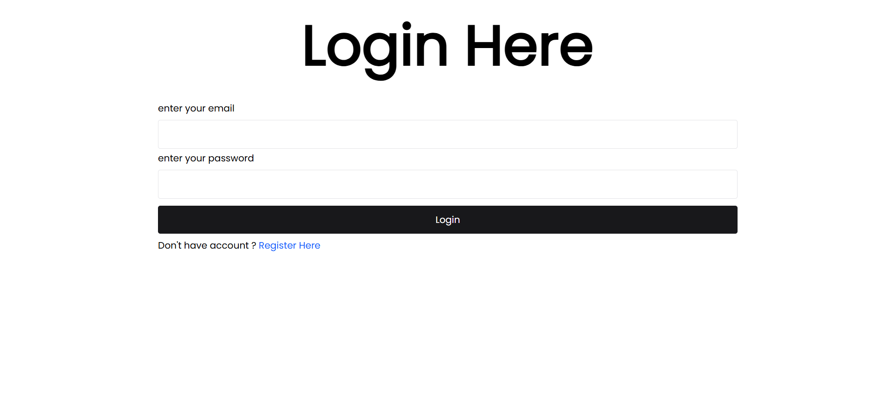
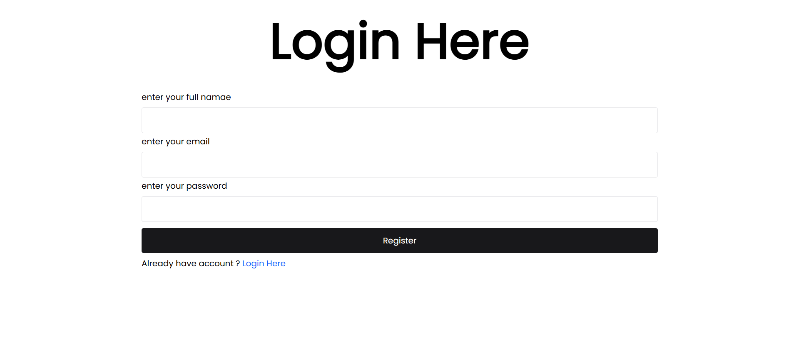
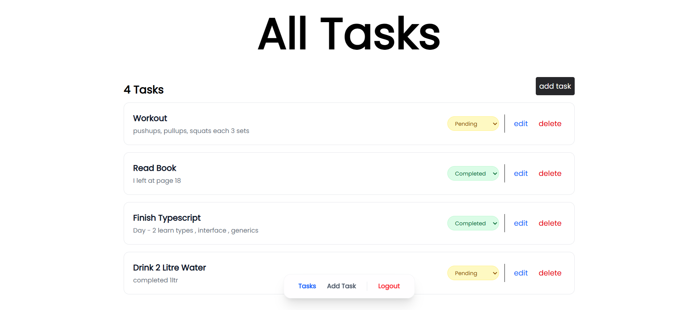
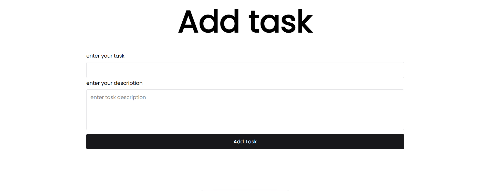
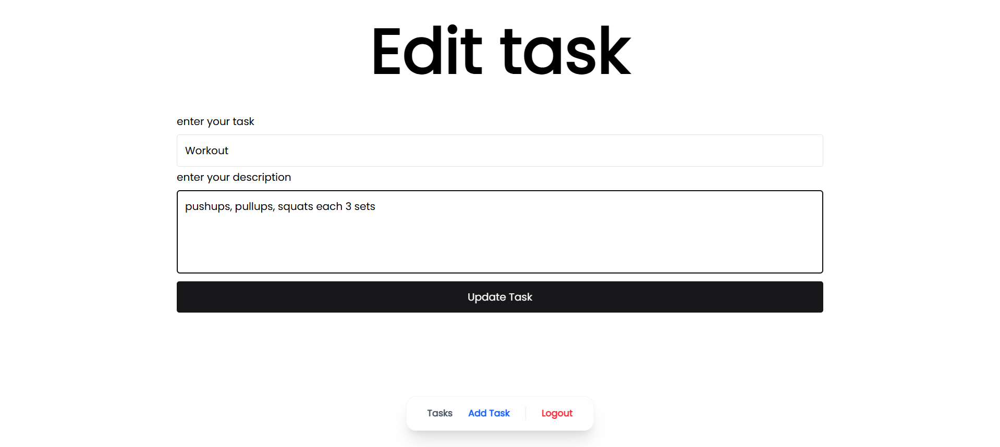

# Mini SaaS Task Management

> A production-ready multi-user task management system with secure JWT authentication, per-user data isolation, and a clean React frontend.

---

## Tech Stack

**Backend**


**Frontend**


---

## Features

- **Auth** — Register, login, JWT-based session, bcrypt password hashing
- **Protected Routes** — Frontend layout guard + backend middleware
- **Task CRUD** — Create, read, update (name/description/status), delete
- **Multi-user isolation** — Every query is scoped to `req.user.id`
- **Inline status toggle** — Pending ↔ Completed via dropdown
- **Input validation** — Zod schemas on both client and server
- **Stable ordering** — Tasks ordered by `created_at ASC`

---

## Project Structure

```
Mini SAAS Task Management/
├── client/                         # React + Vite frontend
│   └── src/
│       ├── api/api.js              # Axios GET/POST/PATCH/DELETE helpers
│       ├── components/
│       │   ├── shared/
│       │   │   ├── Banner.jsx
│       │   │   ├── Loader.jsx      # Spinner: size (sm/md/lg) + fullPage mode
│       │   │   └── NavBar.jsx      # Bottom floating nav + logout
│       │   └── ui/
│       │       ├── Button.jsx      # Submit button with inline loader
│       │       └── InputField.jsx
│       ├── context/
│       │   ├── AuthContext.jsx     # Token state + save/delete helpers
│       │   └── TaskContext.jsx     # Task state + CRUD actions
│       ├── form/
│       │   ├── LoginForm.jsx
│       │   ├── RegisterForm.jsx
│       │   └── TaskForm.jsx
│       ├── layout/
│       │   └── ProtectedLayout.jsx # Redirects to /login if no token
│       ├── pages/
│       │   ├── Login.jsx
│       │   ├── Register.jsx
│       │   ├── AllTasks.jsx
│       │   ├── AddTask.jsx
│       │   └── EditTask.jsx
│       └── schema/
│           ├── auth.schema.js      # Zod — login & register validation
│           └── task.schema.js      # Zod — task name/description/status
│
└── server/                         # Express backend
    └── src/
        ├── controllers/
        │   ├── auth.controller.js  # registerUser, loginUser
        │   └── task.controller.js  # getAllTasks, getSingleTask, addTask, editTask, deleteTask
        ├── db/
        │   └── schema.js           # Drizzle table definitions + Neon connection
        ├── middlewares/
        │   └── auth.middleware.js  # validateJWT — attaches req.user
        ├── routes/
        │   ├── auth.route.js       # /auth/register  /auth/login
        │   └── task.route.js       # /tasks  /tasks/:taskId  (all protected)
        ├── schemas/
        │   ├── auth.schema.js      # Zod — server-side auth validation
        │   └── task.schema.js      # Zod — server-side task validation
        └── utils/
            ├── ApiError.js         # Custom error classes (ValidationError, NotFoundError…)
            ├── ApiSuccess.js       # Standardized { success, statusCode, message, data }
            ├── AsyncHandler.js     # try/catch wrapper for async controllers
            ├── auth.js             # JWT sign/verify + bcrypt hash/compare
            ├── GlobalError.js      # Express 4-arg error handler
            └── validate.js         # Zod .safeParse wrapper
```

---

## Database Schema

```sql
-- Users
CREATE TABLE users (
  id         SERIAL PRIMARY KEY,
  name       VARCHAR(255) NOT NULL,
  email      VARCHAR(255) NOT NULL UNIQUE,
  password   VARCHAR(250) NOT NULL,
  created_at TIMESTAMP DEFAULT NOW()
);

-- Tasks
CREATE TABLE tasks (
  id          SERIAL PRIMARY KEY,
  user_id     INTEGER REFERENCES users(id) ON DELETE CASCADE,
  name        VARCHAR(255) NOT NULL,
  description VARCHAR(255) NOT NULL,
  status      task_status DEFAULT 'pending',   -- ENUM: pending | completed
  created_at  TIMESTAMP DEFAULT NOW()
);
```

---

## API Reference

### Auth &nbsp;`/api/v1/auth`

| Method | Endpoint | Body | Auth |
|--------|----------|------|------|
| POST | `/register` | `{ name, email, password }` | ❌ |
| POST | `/login` | `{ email, password }` | ❌ |

**Response shape (both)**
```json
{
  "success": true,
  "statusCode": 200,
  "message": "...",
  "data": { "id": 1, "name": "...", "email": "...", "token": "..." }
}
```

### Tasks &nbsp;`/api/v1/tasks`

> All routes require header: `auth-token: <jwt>`

| Method | Endpoint | Body | Description |
|--------|----------|------|-------------|
| GET | `/` | — | Get all tasks (current user) |
| POST | `/` | `{ name, description }` | Create a task |
| GET | `/:taskId` | — | Get a single task |
| PATCH | `/:taskId` | `{ name?, description?, status? }` | Update task (partial) |
| DELETE | `/:taskId` | — | Delete a task |

---

## Setup

### Prerequisites
- Node.js v18+
- PostgreSQL database — local or [Neon](https://neon.tech) (free serverless Postgres)

---

### 1. Clone

```bash
git clone <your-repo-url>
cd "Mini SAAS Task Management"
```

---

### 2. Backend

```bash
cd server
npm install
```

Create `server/.env`:

```env
DATABASE_URL=your_postgres_connection_string
JWT_SECRET=your_secret_key
SALT_ROUNDS=10
PORT=4000
```

#### Database setup (run in order)

```bash
# 1. Generate migration files from schema
npm run db:generate

# 2. Apply migrations to the database
npm run db:migrate

# OR — push schema directly (no migration files, good for dev)
npm run db:push
```

> **Tip:** Use `db:push` for quick prototyping. Use `db:generate` + `db:migrate` for a proper migration history.

Start the server:

```bash
npm run dev
# → http://localhost:4000
```

---

### 3. Frontend

```bash
cd client
npm install
npm run dev
# → http://localhost:5173
```

> Ensure the backend is running before starting the frontend.

---

## npm Scripts

### Server (`/server`)

| Script | Command | Description |
|--------|---------|-------------|
| `npm run dev` | `nodemon src/index.js` | Start dev server with hot reload |
| `npm run db:generate` | `drizzle-kit generate` | Generate SQL migration files |
| `npm run db:push` | `drizzle-kit push` | Push schema directly to DB (no migration) |
| `npm run db:migrate` | `drizzle-kit migrate` | Apply generated migration files |

### Client (`/client`)

| Script | Command | Description |
|--------|---------|-------------|
| `npm run dev` | `vite` | Start Vite dev server |
| `npm run build` | `vite build` | Build for production |

---

## Security

| Measure | Implementation |
|---------|----------------|
| Password hashing | bcrypt with configurable salt rounds |
| No password in responses | Auth endpoints return only `id, name, email, token` |
| JWT verification | Every task route passes through `validateJWT` middleware |
| User isolation | All DB queries include `WHERE user_id = req.user.id` |
| Input validation | Zod schemas enforced independently on client and server |
| CORS | Preflight OPTIONS handled before auth middleware |

---

## Screenshots

### Login


### Register


### All Tasks


### Add Task


### Edit Task

